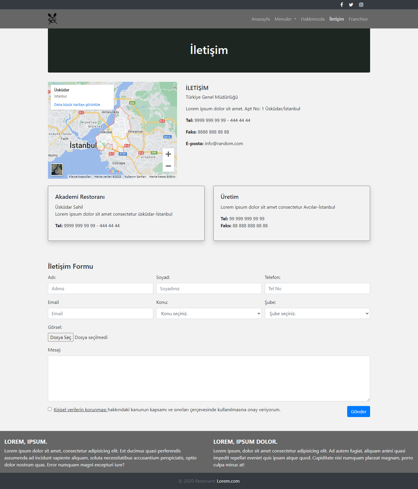
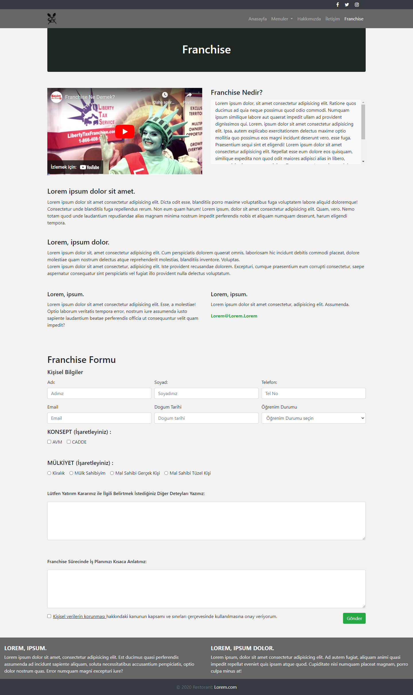

# Frontend - Restaurant website design
Bootstrap ile yapılmış bir restoran web sitesi tasarımı, kullanıcı dostu ve görsel açıdan çekici bir site elde etmek için ideal bir seçenektir. Bootstrap, önceden tasarlanmış öğeleri ve stilleri içerir, bu sayede site tasarımında daha hızlı ve kolay bir şekilde ilerleyebilirsiniz.

Restoran web sitesi tasarımında Bootstrap kullanarak, siteyi tamamen duyarlı hale getirmek mümkündür. Bu, kullanıcıların mobil cihazlar ve tabletler gibi farklı cihazlarda siteye erişmeleri sırasında site içeriğinin boyutunun otomatik olarak ayarlanmasını sağlar.

# Görseller
##Anasayfa

## Menüler

## Hakkımızda

## İletişim

## Franchise
